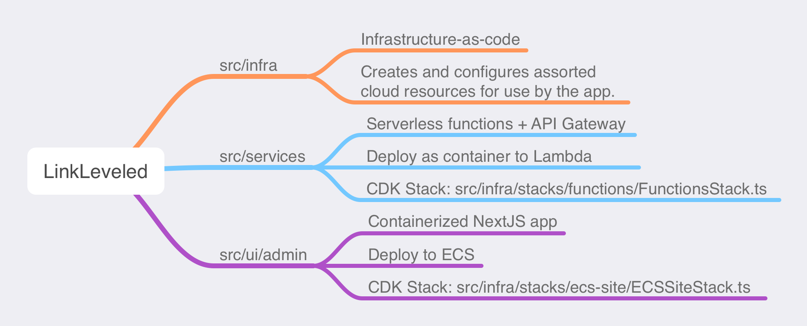

# LinkLeveled

# Overview

This repository houses infrastructure and application code for the LinkLeveled project.

LinkLeveled is a project-in-progress that will provide a platform for users to create and share lists of links. 

## Components



CDK IAC in `src/infra` 

A collection of services in `src/services`

An admin site in `src/ui/admin`

# AWS Accounts
This project assumes a multi-account setup. Eg:

- Management Account
  - Development Account
  - Production Account

Prerequisites for working with CDK can be found here: https://docs.aws.amazon.com/cdk/v2/guide/home.html

Other useful resources:
 - https://github.com/aws-samples/aws-cdk-examples
 - https://docs.aws.amazon.com/cdk/v2/guide/best-practices.html

# Configuration
Examine the directory `/config` for the example configuration file. This file should be customized and renamed to `config.json` before attempting to `cdk synth` or `cdk deploy`.

Note that the configuration in `/config` does not have separate dev/stage/prod versions. Config for each deployment target lives in the same file.

## configBucketName

Because the configuration file contains sensitive information, it is not checked into source control. It should be stored in a bucket in the management account. `config.configBucketName` should be set to the name of the bucket where the live configuration file is stored. The pipeline will download the configuration file from the bucket before synth/deploy.

The config bucket permissions must allow read access from codebuild.amazonaws.com service principal from the management account.

## environments

The environments section of the configuration file should be customized to match the desired environment names, account numbers, etc.

The app uses SSM parameters to allow access to cdk-generated values between the CDK stacks. The `parameterNames` section of the config allows customization of the names of the SSM parameters.

## pipelineRequiresApproval

When `true`, the pipeline will pause at the manual approval stage. When `false`, the pipeline will proceed without manual intervention.

## DNS
This project assumes the TLD hosted zone exists in the management account. The TLD and its hosted zone id must be provided in the configuration file, as `tld` and `tldHzId`.

# Docker
Services in this project are containerized lambdas. Source can be found at `src/services`. The Dockerfile for each service is located in the service's directory. 

When working locally: On `cdk deploy`, the Dockerfile is built and pushed to ECR. Use this command to log docker into ecr before attempting to deploy: `aws ecr get-login-password --region us-east-1 | docker login --username AWS --password-stdin <AccountNumber>.dkr.ecr.us-east-1.amazonaws.com`

The admin site is an ECS service. The dockerfile is located in the `src/ui/admin` directory.

# Functions

## Working locally with lambdas
Use SAM CLI for local iteration.
https://docs.aws.amazon.com/serverless-application-model/latest/developerguide/serverless-cdk-testing.html
https://docs.aws.amazon.com/serverless-application-model/latest/developerguide/serverless-cdk-getting-started.html

This is an overview of the process. Read the entire section on Synth/Build and Auth/IAM before attempting to work locally.

First, `synth` the stack or entire project. Then, `sam build` the lambda. Next, get temporary credentials to allow localhost to talk to DynamoDB, and place those into `local-env.json` (The values from local-env.json will be passed to the service containers as environment variables per the `--container-env-vars` option of the `sam local start-api` command. See the Auth/IAM section below). Finally, `sam local start-api` to start the lambda locally.

## Synth & Build

** Must `synth` before `sam build` **

`cdk synth` copies the source to cdk.out. `sam build` uses the source in cdk.out to build the docker image.

Synth

Synth everything:
`cdk synth`

Or, synth specific stack:
`cdk synth FPDevStage-FPDevFunctionsStack`

Build image:
`sam build -t ./cdk.out/assembly-FPDevStage/FPDevStageFPDevFunctionsStack1DC8F43E.template.json FastPagepageserviceFunctionpageserviceA69CBF46`

Once the image has been built, it can be started locally with `sam local start-api`. This will attempt to start all services defined in `src/infra/stacks/functions/FunctionsStack.ts` (they comprise the resources of an API Gateway Rest API). 

## Auth/IAM
To allow the local lambda emulator server to talk to DynamoDB, temporary credentials must be obtained.

This requires a role ARN from the dev account that has permissions to be assumed by the management account. Put another way, the management account profile must have permissions to assume the role in the dev account.

Sample command to assume the role:
```aws sts assume-role --role-arn <lambda-role-arn (from dev account)> --role-session-name AWSCLI-Session --profile <profile-name (mgmt account)>```

Note that `--profile` should be the name of the profile in your `~/.aws/credentials` file that exists in the management account and has the necessary permissions to assume the role in the dev account.

Copy local-env.sample.json, in the project root, and rename to local-env.json. Fill in the assumed role creds.

Alternately, use `./env-refresh.sh <role arn>` to refresh the local-env.json file with the assumed role creds. 

`sam local ...` must be restarted after refreshing the env file.

Start Local Lambda(s):
`sam local start-api -t ./cdk.out/assembly-FPDevStage/FPDevStageFPDevFunctionsStack1DC8F43E.template.json --container-env-vars ./local-env.json -d 9001`

#### Complete example
```bash
sam build -t ./cdk.out/assembly-FPDevStage/FPDevStageFPDevFunctionsStack1DC8F43E.template.json FastPagepageserviceFunctionpageserviceA69CBF46

aws sts assume-role --role-arn arn:aws:iam::12345678901:role/OrganizationAccountAccessRole --role-session-name AWSCLI-Session --profile default

sam local start-api -t ./cdk.out/assembly-FPDevStage/FPDevStageFPDevFunctionsStack1DC8F43E.template.json --container-env-vars ./local-env.json -d 9001
```

## Cognito
### Testing

If creating test users via console, use this command to set a user's password, removing them from 'Force change password' state:

```bash
aws cognito-idp admin-set-user-password \
--user-pool-id <your-user-pool-id> \
--username <username> \
--password <password> \
--permanent
```

## Pipeline

# Notes

The following became an issue with cdk-generated logical IDs for the lambdas.  

*Issue: When calling SAM CLI like this
```bash
sam local start-lambda -t ./cdk.out/assembly-FPDevStage/FPDevStageFPDevFunctionsStack1DC8F43E.template.json 
```

SAM cannot locate one of the functions defined within the same template. It can locate `FastPagecustomerserviceFunctionF98EF4E7` but not `FastPagepageserviceFunction31146B78`. The error message is: `Error: Unable to find a function or layer with name 'FastPagepageserviceFunction31146B78'`.

When one of the functions is manually removed from _stack_.template.json, the other function can be located by SAM CLI.

https://docs.aws.amazon.com/serverless-application-model/latest/developerguide/serverless-cdk-testing.html

Resolution: Add unique logical IDs to the functions in the CDK stack. 
